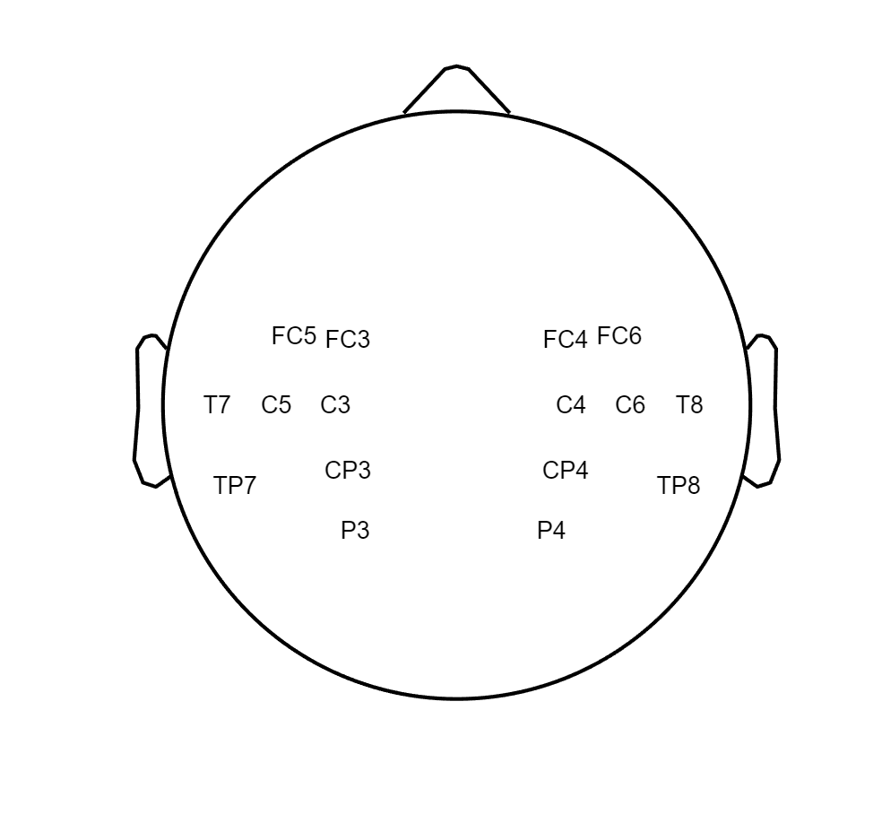
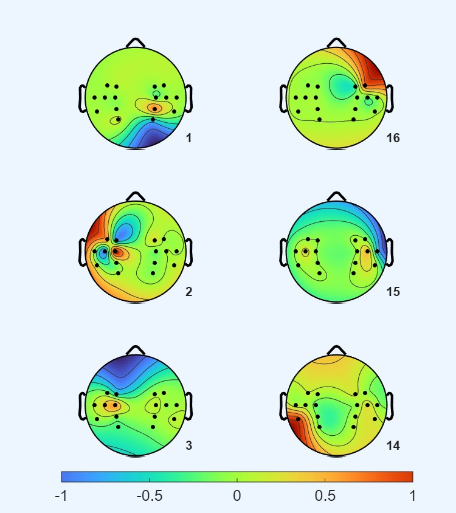
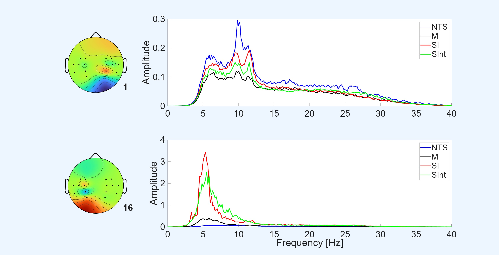
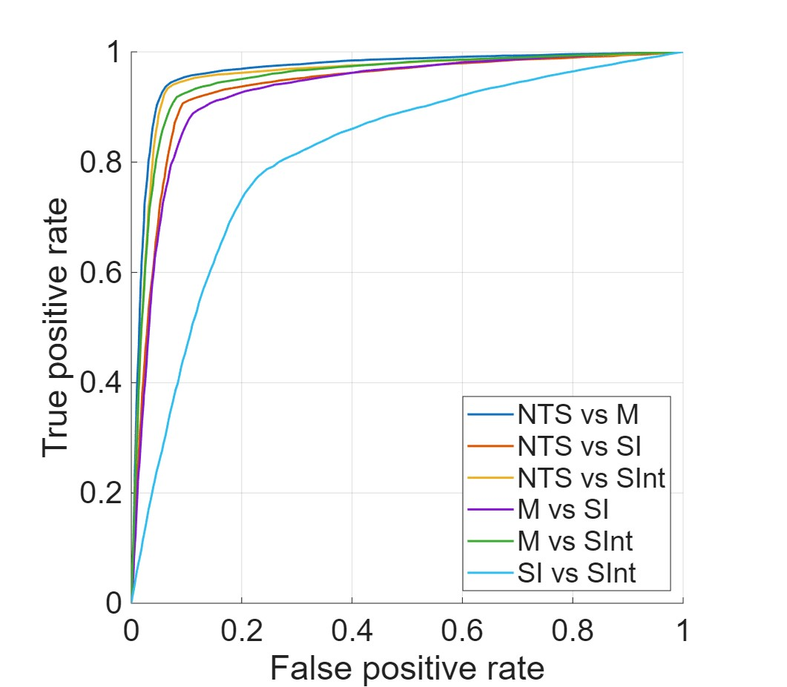

# EEG Vocal Imagery Classification

This repository contains MATLAB code for analyzing Electroencephalographic (EEG) data and classifying vocal imagery (VIm) and vocal intention (VInt) using Common Spatial Pattern (CSP) filtering combined with Support Vector Machine (SVM) classification. This work concluded the results of the manuscript:
📄 [Vocal Imagery vs Intention: Viability of Vocal-Based EEG-BCI Paradigms](https://ieeexplore.ieee.org/abstract/document/9125958)


## Data

Data was acquired from 17 healthy subjects (6 females) using the electrode layout shown below.


Individual recordings are one minute in length and initiated by the subject at convenience. During the recording the subject is performing one of the following task paradigms:

- **Non-task specific (NTS)**: Baseline resting state
- **Motor action (M)**: Physical vocal activation by humming
- **Vocal Imagery (VIm)**: Imagining vocal activation without any physical movement
- **Vocal Intention (VInt)**: Imagining vocal activation while actively preventing physical activation

Data can be shared for research purposes upon request.

## Methods

Analysis pipeline:

1. **Preprocessing**: Bandpass filtering and epoch extraction
2. **CSP Analysis**: Population covariance matrices and spatial filters maximizing inter-paradigm variance
3. **Feature Extraction**: Power spectral density of CSP-filtered signals
4. **Classification**: SVM with k-fold cross-validation
5. **Visualization**: Topographic plots of discriminative spatial patterns

See the [manuscript](https://ieeexplore.ieee.org/abstract/document/9125958) for technical details.

## Repository outputs

Individual scripts provide either figures or accuracy measures for CSP filtering and SVM classification of the selected paradigms. Selected figures are presented here

### Common Spatial Pattern filters
The CSP method generates a filtering matrix with orthonormal columns. Each column is referred to as CSP filter. The first and last column(s) maximizes the variance of one class compared to another. Multiplying the EEG data with the CSP matrix or individual filters brings the data into 'source'-space, reflecting some physiological underlying activity. In NTS vs VIm paradigm this lead to population filters.


### Power Spectral Density
Taking it a step further we can analyze the spectral components of the sources. By estimating CSP filters and computing average periodograms across selected subjects we e.g. found Event Related Desynchronization of filters in some paradigms compared to others.



### Receiver-Operator Curves
Are an indication on the separability of the different paradigm as the bias parameter of the SVM classifier is manipulated. Higher area under the curve indicates higher seperability of the selected paradigms in comparison



## Repository Structure

```
├── recordings/             # EEG data organized by gender and subject
│   ├── FemaleSubjs/        # 6 female subjects
│   └── MaleSubjs/          # 11 male subjects
├── utils/                  # Core processing functions
│   ├── CSP_Weight.m        # CSP weight computation
│   ├── PSD.m               # Power spectral density analysis
│   ├── KFoldValidate.m     # K-fold cross-validation
│   └── ...
├── computedResults/        # Pre-computed matrices and results
├── plotsAndFigures/        # Generated figures and plots
│   └── topoplots/          # Topographic CSP filter visualizations
├── pval_calculations_YS/   # Statistical significance testing
└── script_*.m              # Analysis scripts for figures
```

### Scripts

- `runAll.m` - Runs all analysis scripts sequentially
- `script_generate_topoplots.m` - Generates Figure 4 (CSP topoplots)
- `script_generate_topoplots_w_PSD.m` - Generates Figure 5 (topoplots with PSD)
- `script_generate_roc_figure.m` - ROC curve analysis
- `script_generate_accuracy_vs_epochsize.m` - Classification accuracy vs. epoch size
- `script_generate_gender_accuracy_all_paradigm_combos.m` - Gender-based analysis

## Usage

To reproduce all figures and results:

```matlab
runAll
```

To generate specific analyses:

```matlab
% Generate topographic plots with CSP filters
script_generate_topoplots

% Generate topographic plots with power spectral density analysis
script_generate_topoplots_w_PSD

% Generate ROC curves
script_generate_roc_figure
```

## Requirements

- MATLAB (tested on recent versions)
- Signal Processing Toolbox
- Statistics and Machine Learning Toolbox
- EEGLAB (for topographic plotting functions)

## Authors and Citation

Please cite this article if you use this code or data in your research.

📄 [Vocal Imagery vs Intention: Viability of Vocal-Based EEG-BCI Paradigms](https://ieeexplore.ieee.org/abstract/document/9125958)
